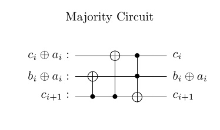
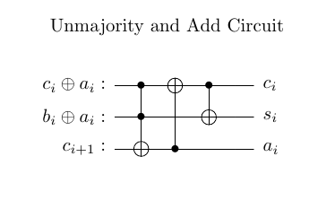
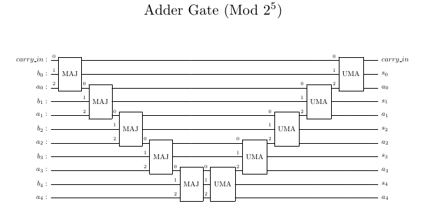
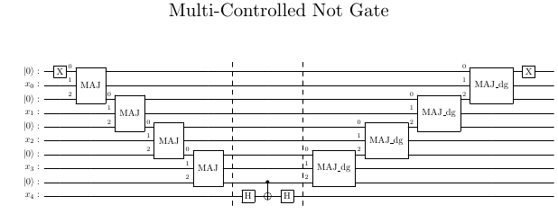
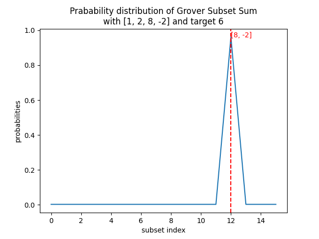
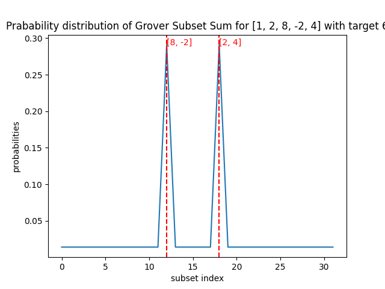
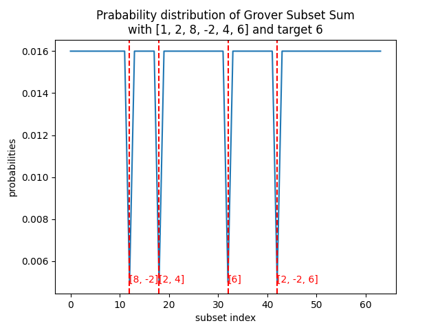
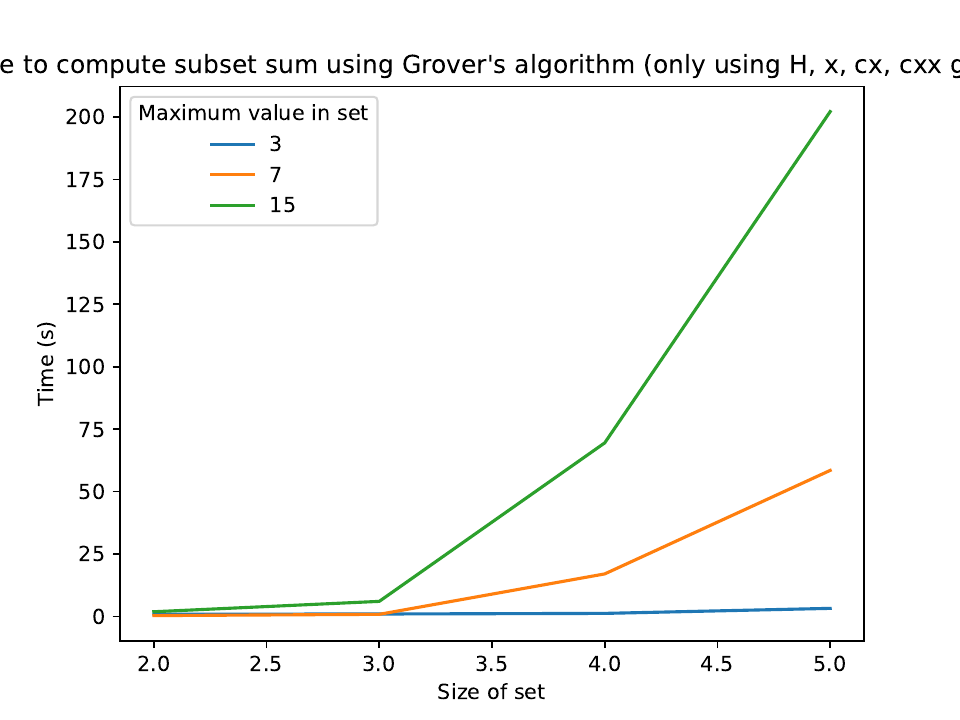

# An implementation of Grover's Algorithm to solve the subset sum problem

## Background

### The subset Sum Problem

The Subset Sum problem is the decision problem, where given a set of $n$ values $x_i$ and a target value $t$, is there a collection of indicies $I \subseteq [n]$ such that $\sum_{i\in I}x_i = t$?

The Subset sum problem is an NP-complete problem and it is interesting to ask how we might use quatum computing to solve this question.

### Grover's Algorithm

Grover's algorithm is an quantum algorithm that, through a series of reflections, solves the unstructured search problem (identifying a marked value) in $\mathcal{O}(\sqrt{n})$ quantum gates.

## Implementation

Of note, here I implement Grover's algorithm to answer the subset sum problem using only NOT, CNOT, TOFELLI, and HADAMARD gates.

To do this I first implemented an adder as outlined in [https://arxiv.org/pdf/quant-ph/0410184].

This adder uses two building block

  

which can be combined to create an adder $|ab0\rangle \to |as0\rangle$

By running the adder on numbers represented in two's complement, we can include negative numbers as inputs (as long as all values use at most $d-1$ bits

The Majority gate can also be used to implement a multiple controlled Z gate (mcz) which can be useful for the reflections in both the oracle and the diffuser when implementing Grover's algorithm

## Testing
Here are a few examples of the output of the algorithm apllied to $|00 \ldots 0\rangle$

Input set: \[1,2,8,-2\] with target 6

Input set: \[1,2,8,-2, 4\] with target 6

Though, we can see that having too many solution can mess with how Grover's algorithm handles reflections:

Input set: \[1,2,8,-2, 4, 6\] with target 6

## Benchmarking

I ran some benchmarking with various number input values and various sizes of input values. The result can be summarized as follows:

